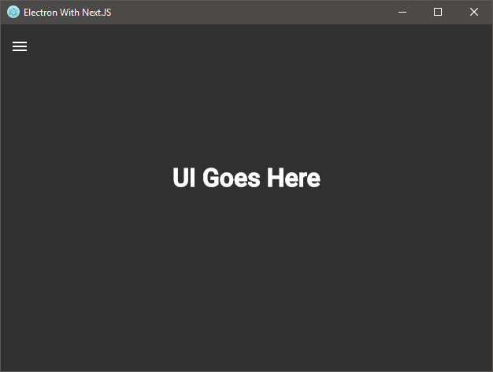
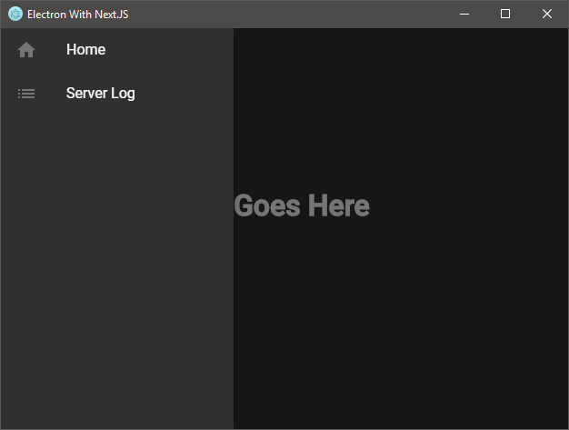
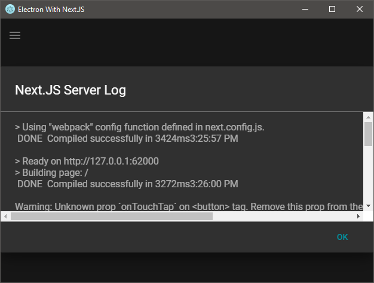
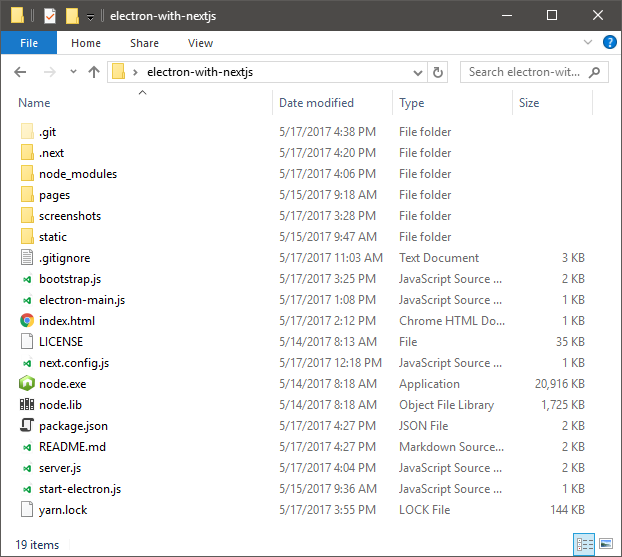

# NOTE: THIS IS A WORK IN PROGRESS, THINGS CHANGING RAPIDLY

# electron-with-nextjs

A project that spawns a Next.JS app from Electron and uses it to serve it's 
content.

App Main UI:



Drawer:



Server Log:



## Architecture

(TODO...)

Just a real quick note about `pages/index.js`... It's a mess, it'll be fixed 
soon.

## How To Run

(I'll revise this later but want to get something here quickly.)

Here is what the source layout looks like (notice a splistreamed version of 
Node.exe and Node.lib. This will be used to spawn the Next.JS app)

Source Folder Layout:




The instructions to run 'electron-with-nextjs' are almost entirely the same as 
with my other project [electron-with-express](https://github.com/frankhale/electron-with-express).

What differs is that for a production build you need to run 'next build' and
change the the 'production' key in the 'node' section of package.json to true.

For instance (for running in production):

```
  "node": {
    "exe": ".\\node.exe",
    "args": ["server.js"],
    "production": true
  },
```

Then to run you type: `npm run start`

If you just want to run in dev make sure the 'production' key is set to false and then just run it with `npm run start`

**NOTE**: Running in development mode is pretty slow to boot. This is normal as Next.js is doing it's thing and getting ready to serve the page. Running in production mode after doing a build is fast.

## Author(s)

Frank Hale &lt;frankhale@gmail.com&gt;  
17 May 2017

## License

GNU GPL v3 - see [LICENSE](LICENSE)
